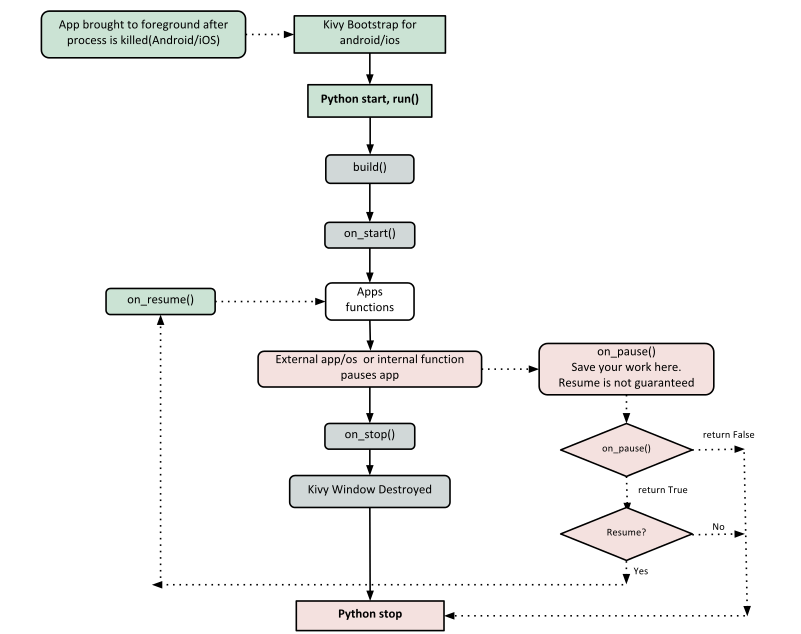

# kivy
用Python编写的开源UI框架，在Windows，Linux，macOS，Android和iOS上运行 https://kivy.org


Kivy是一个开源的跨平台Python 框架，用于开发利用创新的多点触控用户界面的应用程序。目的是允许快速简便的交互设计和快速原型设计，同时使代码可重用和可部署。

Kivy是用Python和Cython编写的，基于OpenGL ES 2，支持各种输入设备，并具有广泛的小部件库。使用相同的代码库，您可以定位Windows，OS X，Linux，Android和iOS。所有Kivy小部件都支持多点触控。

Kivy是麻省理工学院的许可证，由一个伟大的社区积极开发，并得到Kivy组织管理的许多项目的支持。

## Installaion
```bash
$ brew install pkg-config sdl2 sdl2_image sdl2_ttf sdl2_mixer gstreamer
$ pip3 install Cython==0.28.3 kivy
```

## Kivy App的生命周期


## kivy on android
Kivy APK是普通的Android应用程序，你可以像任何其他人一样分发，包括Play商店等商店。它们在暂停或重新启动时表现正常，可以使用Android服务并可以访问大多数正常的Java API

#### Buildozer
Buildozer是一个自动化整个构建过程的工具。它下载并设置python-for-android的所有先决条件，包括android SDK和NDK，然后构建一个可以自动推送到设备的apk。

Buildozer目前仅适用于Linux，并且是alpha版本，但它已经运行良好并且可以显着简化apk构建。
```bash
$ git clone https://github.com/kivy/buildozer.git
$ cd buildozer
$ sudo python2.7 setup.py install
```
这将在您的系统中安装buildozer。然后，导航到项目目录并运行
```bash
$ buildozer init
```
这将创建一个控制构建配置的buildozer.spec文件。
您应该使用您的应用程序名称等对其进行适当编辑。
您可以设置变量来控制传递给python-for-android的大部分或全部参数

安装buildozer的[依赖项](https://buildozer.readthedocs.io/en/latest/installation.html#targeting-android)。

最后，插入你的Android设备并运行

```bash
$ buildozer android debug deploy run
```
在您的设备上构建，推送并自动运行apk。

Buildozer有许多可用的选项和工具可以帮助您，上述步骤只是构建和运行APK的最简单方法。完整的文档可[在此处获得](http://buildozer.readthedocs.org/en/latest/)。您还可以访问https://github.com/kivy/buildozer查看Buildozer README 

#### 用python-for-android打包
你也可以直接使用python-for-android打包，它可以为你提供更多控制，但需要你手动下载部分Android工具链。

有关 完整详细信息，请参阅[python-for-android文档](https://python-for-android.readthedocs.io/en/latest/quickstart/)

## kivy on ios
