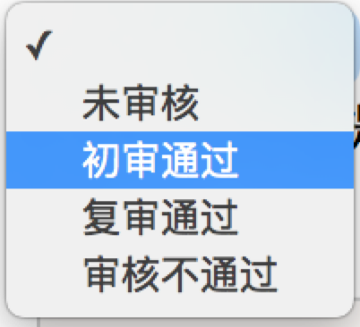

# Selenium
Selenium是一个Web的自动化测试工具，最初是为网站自动化测试而开发的，类型像我们玩游戏用的按键精灵，可以按指定的命令自动操作，不同是Selenium 可以直接运行在浏览器上，它支持所有主流的浏览器（包括PhantomJS这些无界面的浏览器）。

Selenium 可以根据我们的指令，让浏览器自动加载页面，获取需要的数据，甚至页面截屏，或者判断网站上某些动作是否发生。

Selenium 自己不带浏览器，不支持浏览器的功能，它需要与第三方浏览器结合在一起才能使用。但是我们有时候需要让它内嵌在代码中运行，所以我们可以用一个叫 PhantomJS 的工具代替真实的浏览器。

- [Selenium 官方参考文档](http://selenium-python.readthedocs.io/index.html)
- [最新selenium 官方参考文档](https://seleniumhq.github.io/docs/index.html)

## selenium IDE
Selenium IDE是一个Firefox/chrome插件，可用于记录Firefox本身的测试步骤。Selenium IDE可用于以 各种编程语言（即C＃，Java，Python和Ruby）生成快速而肮脏的测试代码。

鉴于通过Selenium IDE生成的代码的可维护性，建议不要将其用于了解元素定位器或生成 丢弃代码。我们确信，一旦习惯了WebDriver API，就永远不会使用Selenium IDE。

## PhantomJS
PhantomJS 是一个基于Webkit的“无界面”(headless)浏览器，它会把网站加载到内存并执行页面上的 JavaScript，因为不会展示图形界面，所以运行起来比完整的浏览器要高效。

如果我们把 Selenium 和 PhantomJS 结合在一起，就可以运行一个非常强大的网络爬虫了，这个爬虫可以处理 JavaScrip、Cookie、headers，以及任何我们真实用户需要做的事情
```html
注意：PhantomJS 只能从它的官方网站http://phantomjs.org/download.html) 下载。 因为 PhantomJS 是一个功能完善(虽然无界面)的浏览器而非一个 Python 库，所以它不需要像 Python 的其他库一样安装，但我们可以通过Selenium调用PhantomJS来直接使用。
```
PhantomJS [官方参考文档：](http://phantomjs.org/documentation)
## 快速入门
Selenium 库里有个叫 WebDriver 的 API。WebDriver 有点儿像可以加载网站的浏览器，但是它也可以像 BeautifulSoup 或者其他 Selector 对象一样用来查找页面元素，与页面上的元素进行交互 (发送文本、点击等)，以及执行其他动作来运行网络爬虫。

## 页面操作
Selenium 的 WebDriver提供了各种方法来寻找元素，假设下面有一个表单输入框：
```html
<input type="text" name="user-name" id="passwd-id" />
```
那么：
```python
# 获取id标签值
element = driver.find_element_by_id("passwd-id")
# 获取name标签值
element = driver.find_element_by_name("user-name")
# 获取标签名值
element = driver.find_elements_by_tag_name("input")
# 也可以通过XPath来匹配
element = driver.find_element_by_xpath("//input[@id='passwd-id']")
```
## 定位UI元素 (WebElements)
关于元素的选取，有如下的API 单个元素选取
```python
find_element_by_id
find_elements_by_name
find_elements_by_xpath
find_elements_by_link_text
find_elements_by_partial_link_text
find_elements_by_tag_name
find_elements_by_class_name
find_elements_by_css_selector
```
```
注意:
二、element和elements傻傻分不清
1.element方法定位到是是单数，是直接定位到元素
2.elements方法是复数，这个学过英文的都知道，定位到的是一组元素，返回的是list队列
```

#### By ID
```html
<div id="coolestWidgetEvah">...</div>
```
实现:
```python
element = driver.find_element_by_id("coolestWidgetEvah")
------------------------ or -------------------------
from selenium.webdriver.common.by import By
element = driver.find_element(by=By.ID, value="coolestWidgetEvah")
```
#### By Class Name
```html
<div class="cheese"><span>Cheddar</span></div><div class="cheese"><span>Gouda</span></div>
```
实现:
```python
cheeses = driver.find_elements_by_class_name("cheese")
------------------------ or -------------------------
from selenium.webdriver.common.by import By
cheeses = driver.find_elements(By.CLASS_NAME, "cheese")
```

#### By Tag Name
```html
<iframe src="..."></iframe>
```
实现:
```python
frame = driver.find_element_by_tag_name("iframe")
------------------------ or -------------------------
from selenium.webdriver.common.by import By
frame = driver.find_element(By.TAG_NAME, "iframe")
```
#### By Name
```html
<input name="cheese" type="text"/>
```
实现：
```python
cheese = driver.find_element_by_name("cheese")
------------------------ or -------------------------
from selenium.webdriver.common.by import By
cheese = driver.find_element(By.NAME, "cheese")
```
#### By Link Text
```html
<a href="http://www.google.com/search?q=cheese">cheese</a>
```
实现:
```python
cheese = driver.find_element_by_link_text("cheese")
------------------------ or -------------------------
from selenium.webdriver.common.by import By
cheese = driver.find_element(By.LINK_TEXT, "cheese")
```
#### By Partial Link Text
```html
<a href="http://www.google.com/search?q=cheese">search for cheese</a>>
```
实现:
cheese = driver.find_element_by_partial_link_text("cheese")
------------------------ or -------------------------
from selenium.webdriver.common.by import By
cheese = driver.find_element(By.PARTIAL_LINK_TEXT, "cheese")
#### By CSS
```html
<div id="food"><span class="dairy">milk</span><span class="dairy aged">cheese</span></div>
```
实现:
```python
cheese = driver.find_element_by_css_selector("#food span.dairy.aged")
------------------------ or -------------------------
from selenium.webdriver.common.by import By
cheese = driver.find_element(By.CSS_SELECTOR, "#food span.dairy.aged")
```
#### By XPath
```html
<input type="text" name="example" />
<INPUT type="text" name="other" />
```
实现:
```python
inputs = driver.find_elements_by_xpath("//input")
------------------------ or -------------------------
from selenium.webdriver.common.by import By
inputs = driver.find_elements(By.XPATH, "//input")
```
#### 鼠标动作链
有些时候，我们需要再页面上模拟一些鼠标操作，比如双击、右击、拖拽甚至按住不动等，我们可以通过导入 ActionChains 类来做到：

#### 填充表单
我们已经知道如何在文本框中输入文字, 但有时候我们会碰到<select></select>标签的下拉框, 直接点击下拉框中选项不一定可行
```html
<select id="status" class="form-control valid" onchange="" name="status">
    <option value=""></option>
    <option value="0">未审核</option>
    <option value="1">初审通过</option>
    <option value="2">复审通过</option>
    <option value="3">审核不通过</option>
</select>
```

Selenium专门提供了Select类来处理下拉框。 其实 WebDriver 中提供了一个叫 Select 的方法，可以帮助我们完成这些事情：

#### 页面前进和后退
操作页面的前进和后退功能:
```python
driver.forward()    # 前进
driver.back()       # 后退
```
#### Cookies
获取每个页面的cookies值，用法如下
```python
for cookies indriver.get_cookies():
    print("%s -> %s" % (cookie['name'], cookie['value']))
```
删除cookies,用法如下:
```python
# By name 
driver.delete_cookie('CookieName')

# all
driver.delete_all_cookies()
```
### 页面等待
注意：这是非常重要的一部分！！

现在的网页越来越多采用了 Ajax 技术，这样程序便不能确定何时某个元素完全加载出来了。如果实际页面等待时间过长导致某个dom元素还没出来，但是你的代码直接使用了这个WebElement，那么就会抛出NullPointer的异常。

为了避免这种元素定位困难而且会提高产生 ElementNotVisibleException 的概率。所以 Selenium 提供了两种等待方式，一种是隐式等待，一种是显式等待。

隐式等待是等待特定的时间，显式等待是指定某一条件直到这个条件成立时继续执行。
#### 显式等待
显式等待指定某个条件，然后设置等待时间。如果这个时间没有找到元素，那么便会抛出异常了

下面是一些内置的等待条件，你可以直接调用这些条件，而不用自己写某些等待条件了:
```html
title_is
title_contains
presence_of_element_located
visibility_of_element_located
visibility_of
presence_of_all_elements_located
text_to_be_present_in_element
text_to_be_present_in_element_value
frame_to_be_available_and_switch_to_it
invisibility_of_element_located
element_to_be_clickable – it is Displayed and Enabled.
staleness_of
element_to_be_selected
element_located_to_be_selected
element_selection_state_to_be
element_located_selection_state_to_be
alert_is_present
```
#### 隐式等待
隐式等待比较简单，就是简单地设置一个等待时间, 单位为秒

如果不设置，默认等待时间为0


