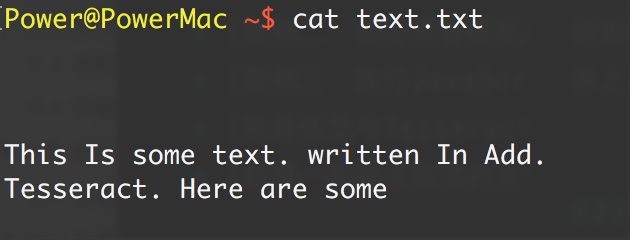
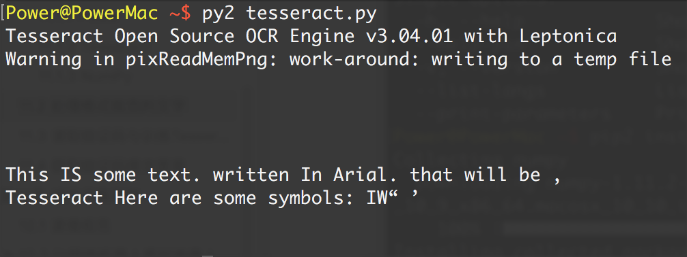

## 处理规范的文字
通常,格式规范的文字具有以下特点:
```
* 使用一个标准字体(不包含手写体、草书,或者十分“花哨的”字体) • 虽然被复印或拍照,字体还是很清晰,没有多余的痕迹或污点
* 排列整齐,没有歪歪斜斜的字
* 没有超出图片范围,也没有残缺不全,或紧紧贴在图片的边缘
```
文字的一些格式问题在图片预处理时可以进行解决。例如,可以把图片转换成灰度图,调 整亮度和对比度,还可以根据需要进行裁剪和旋转（详情请关注图像与信号处理），但是,这些做法在进行更具扩展性的 训练时会遇到一些限制
### 格式规范文字的理想示例

通过下面的命令运行 Tesseract，读取文件并把结果写到一个文本文件中: 
```shell
tesseract test.jpg text
```
cat text.txt 即可显示结果。

识别结果很准确,不过符号^和*分别被表示成了双引号和单引号。大体上可以让你很舒服地阅读。

识别结果很准确,不过符号^和*分别被表示成了双引号和单引号。大体上可以让你很舒服地阅读。

# mac的tessdata训练字库位置
```shell
/usr/local/share/tessdata
```

## 对图片进行阈值过滤和降噪处理
很多时候我们在网上会看到这样的图片：

Tesseract 不能完整处理这个图片,主要是因为图片背景色是渐变的,最终结果是这样:

随着背景色从左到右不断加深,文字变得越来越难以识别,Tesseract 识别出的 每一行的最后几个字符都是错的。

遇到这类问题,可以先用 Python 脚本对图片进行清理。利用 Pillow 库,我们可以创建一个 阈值过滤器来去掉渐变的背景色,只把文字留下来,从而让图片更加清晰,便于 Tesseract 读取:

通过一个阈值对前面的“模糊”图片进行过滤的结果

除了一些标点符号不太清晰或丢失了,大部分文字都被读出来了。Tesseract 给出了最好的 结果:


## 从网站图片中抓取文字
网站上的图片可能并不是故意把文字做得很花哨 (就像餐馆菜单的 JPG 图片上的艺术字),但它们上面的文字对网络爬虫来说就是隐藏起来 了

举个例子：
```
* 虽然亚马逊的 robots.txt 文件允许抓取网站的产品页面,但是图书的预览页通常不让网络机 器人采集。

* 图书的预览页是通过用户触发 Ajax 脚本进行加载的,预览图片隐藏在 div 节点 下面;
  其实,普通的访问者会觉得它们看起来更像是一个 Flash 动画,而不是一个图片文 件。当然,即使我们能获得图片,要把它们读成文字也没那么简单。

* 下面的程序就解决了这个问题:首先导航到托尔斯泰的《战争与和平》的大字号印刷版 1, 
  打开阅读器,收集图片的 URL 链接,然后下载图片,识别图片,最后打印每个图片的文 字。
  因为这个程序很复杂,利用了前面几章的多个程序片段,所以我增加了一些注释以让 每段代码的目的更加清晰:
```
如果想把文字加工成普通人可以看懂的 效果,还需要花很多时间去处理。

下次将介绍另一种方法来解决文字混乱的问题,尤其是当你愿意花一点儿时间训练 Tesseract 的时候。

通过给 Tesseract 提供大量已知的文字与图片映射集,经过训练 Tesseract 就可以“学会”识别同一种字体,而且可以达到极高的精确率和准确率,甚至可以忽略图 片中文字的背景色和相对位置等问题。

## 大多数网站生成的验证码图片都具有以下属性
```html
* 它们是服务器端的程序动态生成的图片。验证码图片的 src 属性可能和普通图片不太一 样，比如 ，但是可以和其他图片一样进行 下载和处理。
* 图片的答案存储在服务器端的数据库里。
* 很多验证码都有时间限制，如果你太长时间没解决就会失效。
* 常用的处理方法就是，首先把验证码图片下载到硬盘里，清理干净，然后用 Tesseract 处理 图片，最后返回符合网站要求的识别结果
```
