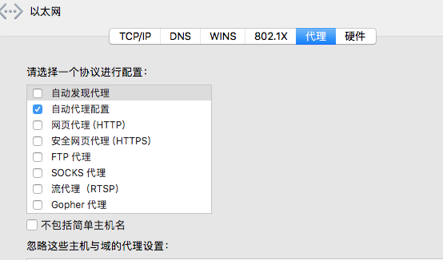
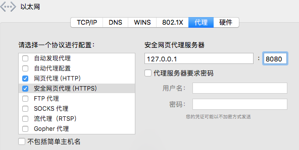

# mitmproxy
顾名思义，mitmproxy 就是用于 MITM 的 proxy，MITM 即中间人攻击（Man-in-the-middle attack）。用于中间人攻击的代理首先会向正常的代理一样转发请求，保障服务端与客户端的通信，其次，会适时的查、记录其截获的数据，或篡改数据，引发服务端或客户端特定的行为。

不同于 fiddler 或 wireshark 等抓包工具，mitmproxy 不仅可以截获请求帮助开发者查看、分析，更可以通过自定义脚本进行二次开发。举例来说，利用 fiddler 可以过滤出浏览器对某个特定 url 的请求，并查看、分析其数据，但实现不了高度定制化的需求，类似于：“截获对浏览器对该 url 的请求，将返回内容置空，并将真实的返回内容存到某个数据库，出现异常时发出邮件通知”。而对于 mitmproxy，这样的需求可以通过载入自定义 python 脚本轻松实现。

但 mitmproxy 并不会真的对无辜的人发起中间人攻击，由于 mitmproxy 工作在 HTTP 层，而当前 HTTPS 的普及让客户端拥有了检测并规避中间人攻击的能力，所以要让 mitmproxy 能够正常工作，必须要让客户端（APP 或浏览器）主动信任 mitmproxy 的 SSL 证书，或忽略证书异常，这也就意味着 APP 或浏览器是属于开发者本人的——显而易见，这不是在做黑产，而是在做开发或测试。

那这样的工具有什么实际意义呢？目前比较广泛的应用是做仿真爬虫，即利用手机模拟器、无头浏览器来爬取 APP 或网站的数据，mitmpproxy 作为代理可以拦截、存储爬虫获取到的数据，或修改数据调整爬虫的行为。

事实上，以上说的仅是 mitmproxy 以正向代理模式工作的情况，通过调整配置，mitmproxy 还可以作为透明代理、反向代理、上游代理、SOCKS 代理等，但这些工作模式针对 mitmproxy 来说似乎不大常用.

[github](https://github.com/mitmproxy/mitmproxy)

[官方doc](https://docs.mitmproxy.org/stable)

## 安装
```bash
$ pip3 install mitmproxy
```

## 常用功能
- 拦截HTTP和HTTPS请求和响应。
- 保存HTTP会话并进行分析。
- 模拟客户端发起请求，模拟服务端返回响应。
- 利用反向代理将流量转发给指定的服务器。
- 支持Mac和Linux上的透明代理。
- 利用Python对HTTP请求和响应进行实时处理。

## 启动
```bash
# 它会监听8080端口
$ mitmproxy
# 常用
$ mitmweb
```

## mitmdump的使用
mitmdump是mitmproxy的命令行接口，同时还可以对接Python对请求进行处理，这是相比Fiddler、Charles等工具更加方便的地方。有了它我们可以不用手动截获和分析HTTP请求和响应，只需写好请求和响应的处理逻辑即可。它还可以实现数据的解析、存储等工作，这些过程都可以通过Python实现。

## 下断点
```bash
输入i,进入编辑模式,可在最下面编辑条件,ESC或Enter退出编辑
断点的条件和过滤是一样的,符合条件的链接会被拦截
比如这个 : ~d safecode & ~m post & ~u \.php
域名包含safecode,链接包含.php的post请求会被拦截
```

# 脚本
eg:
```python
import mitmproxy.http
from mitmproxy import ctx

class Counter:
    def __init__(self):
        self.num = 0

    def request(self, flow: mitmproxy.http.HTTPFlow):
        self.num = self.num + 1
        ctx.log.info("We've seen %d flows" % self.num)

# 一个叫 Counter 的 addon
addons = [
    Counter()
]
```

# 事件
事件针对不同生命周期分为 5 类。“生命周期”这里指在哪一个层面看待事件，举例来说，同样是一次 web 请求，我可以理解为“HTTP 请求 -> HTTP 响应”的过程，也可以理解为“TCP 连接 -> TCP 通信 -> TCP 断开”的过程。那么，如果我想拒绝来个某个 IP 的客户端请求，应当注册函数到针对 TCP 生命周期 的 tcp_start 事件，又或者，我想阻断对某个特定域名的请求时，则应当注册函数到针对 HTTP 声明周期的 http_connect 事件。其他情况同理。

1. 针对 HTTP 生命周期
```python
def http_connect(self, flow: mitmproxy.http.HTTPFlow):
```
(Called when) 收到了来自客户端的 HTTP CONNECT 请求。在 flow 上设置非 2xx 响应将返回该响应并断开连接。CONNECT 不是常用的 HTTP 请求方法，目的是与服务器建立代理连接，仅是 client 与 proxy 的之间的交流，所以 CONNECT 请求不会触发 request、response 等其他常规的 HTTP 事件。
```python
def requestheaders(self, flow: mitmproxy.http.HTTPFlow):
```
(Called when) 来自客户端的 HTTP 请求的头部被成功读取。此时 flow 中的 request 的 body 是空的。
```python
def request(self, flow: mitmproxy.http.HTTPFlow):
```
(Called when) 来自客户端的 HTTP 请求被成功完整读取。
```python
def responseheaders(self, flow: mitmproxy.http.HTTPFlow):
```
(Called when) 来自服务端的 HTTP 响应的头部被成功读取。此时 flow 中的 response 的 body 是空的。
```python
def response(self, flow: mitmproxy.http.HTTPFlow):
```
(Called when) 来自服务端端的 HTTP 响应被成功完整读取。
```python
def error(self, flow: mitmproxy.http.HTTPFlow):
```
(Called when) 发生了一个 HTTP 错误。比如无效的服务端响应、连接断开等。注意与“有效的 HTTP 错误返回”不是一回事，后者是一个正确的服务端响应，只是 HTTP code 表示错误而已。

2. 针对 TCP 生命周期
```python
def tcp_start(self, flow: mitmproxy.tcp.TCPFlow):
```
(Called when) 建立了一个 TCP 连接。
```python
def tcp_message(self, flow: mitmproxy.tcp.TCPFlow):
```
(Called when) TCP 连接收到了一条消息，最近一条消息存于 flow.messages[-1]。消息是可修改的。
```python
def tcp_error(self, flow: mitmproxy.tcp.TCPFlow):
```
(Called when) 发生了 TCP 错误。
```python
def tcp_end(self, flow: mitmproxy.tcp.TCPFlow):
```
(Called when) TCP 连接关闭。

3. 针对 Websocket 生命周期
```python
def websocket_handshake(self, flow: mitmproxy.http.HTTPFlow):
```
(Called when) 客户端试图建立一个 websocket 连接。可以通过控制 HTTP 头部中针对 websocket 的条目来改变握手行为。flow 的 request 属性保证是非空的的。
```python
def websocket_start(self, flow: mitmproxy.websocket.WebSocketFlow):
```
(Called when) 建立了一个 websocket 连接。
```python
def websocket_message(self, flow: mitmproxy.websocket.WebSocketFlow):
```
(Called when) 收到一条来自客户端或服务端的 websocket 消息。最近一条消息存于 flow.messages[-1]。消息是可修改的。目前有两种消息类型，对应 BINARY 类型的 frame 或 TEXT 类型的 frame。
```python
def websocket_error(self, flow: mitmproxy.websocket.WebSocketFlow):
```
(Called when) 发生了 websocket 错误。
```python
def websocket_end(self, flow: mitmproxy.websocket.WebSocketFlow):
```
(Called when) websocket 连接关闭。

4. 针对网络连接生命周期
```python
def clientconnect(self, layer: mitmproxy.proxy.protocol.Layer):
```
(Called when) 客户端连接到了 mitmproxy。注意一条连接可能对应多个 HTTP 请求。
```python
def clientdisconnect(self, layer: mitmproxy.proxy.protocol.Layer):
```
(Called when) 客户端断开了和 mitmproxy 的连接。
```python
def serverconnect(self, conn: mitmproxy.connections.ServerConnection):
```
(Called when) mitmproxy 连接到了服务端。注意一条连接可能对应多个 HTTP 请求。
```python
def serverdisconnect(self, conn: mitmproxy.connections.ServerConnection):
```
(Called when) mitmproxy 断开了和服务端的连接。
```python
def next_layer(self, layer: mitmproxy.proxy.protocol.Layer):
```
(Called when) 网络 layer 发生切换。你可以通过返回一个新的 layer 对象来改变将被使用的 layer。详见 [layer](https://github.com/mitmproxy/mitmproxy/blob/fc80aa562e5fdd239c82aab1ac73502adb4f67dd/mitmproxy/proxy/protocol/__init__.py#L2) 的定义。

5. 通用生命周期
```python
def configure(self, updated: typing.Set[str]):
```
(Called when) 配置发生变化。updated 参数是一个类似集合的对象，包含了所有变化了的选项。在 mitmproxy 启动时，该事件也会触发，且 updated 包含所有选项。
```python
def done(self):
```
(Called when) addon 关闭或被移除，又或者 mitmproxy 本身关闭。由于会先等事件循环终止后再触发该事件，所以这是一个 addon 可以看见的最后一个事件。由于此时 log 也已经关闭，所以此时调用 log 函数没有任何输出。
```python
def load(self, entry: mitmproxy.addonmanager.Loader):
```
(Called when) addon 第一次加载时。entry 参数是一个 Loader 对象，包含有添加选项、命令的方法。这里是 addon 配置它自己的地方。
```python
def log(self, entry: mitmproxy.log.LogEntry):
```
(Called when) 通过 mitmproxy.ctx.log 产生了一条新日志。小心不要在这个事件内打日志，否则会造成死循环。
```python
def running(self):
```
(Called when) mitmproxy 完全启动并开始运行。此时，mitmproxy 已经绑定了端口，所有的 addon 都被加载了。
```python
def update(self, flows: typing.Sequence[mitmproxy.flow.Flow]):
```
(Called when) 一个或多个 flow 对象被修改了，通常是来自一个不同的 addon。

## 常用
大多数情况下我们只会用到针对 HTTP 生命周期的几个事件。再精简一点，甚至只需要用到 http_connect、request、response 三个事件就能完成大多数需求了。

这里以一个稍微有点黑色幽默的例子，覆盖这三个事件，展示如果利用 mitmproxy 工作。

需求是这样的：

1. 因为百度搜索是不靠谱的，所有当客户端发起百度搜索时，记录下用户的搜索词，再修改请求，将搜索词改为“360 搜索”；
2. 因为 360 搜索还是不靠谱的，所有当客户端访问 360 搜索时，将页面中所有“搜索”字样改为“请使用谷歌”。
3. 因为谷歌是个不存在的网站，所有就不要浪费时间去尝试连接服务端了，所有当发现客户端试图访问谷歌时，直接断开连接。
4. 将上述功能组装成名为 Joker 的 addon，并保留之前展示名为 Counter 的 addon，都加载进 mitmproxy。

## 抓包mac
### 设置

#### mac安装证书
```bash
# 1.
$ cp ~/.mitmproxy/mitmproxy-ca.pem ~/Desktop
# 2.
# 双击证书安装并信任
```

#### 设置flow定向
before



end



抓完记得设置回去!

## 抓包app
android 
```bash
# 手机浏览器 http://mitm.it
```
问题
```python
# TODO OPPO R15手机无法安装mitmproxy证书
# $ adb push mitmproxy-ca-cert.cer sdcard/mitm.cer

# TODO Android7.0以上使用Charles抓包Https
# 由于Android7以后google更改了安全策略，用户添加的CA证书不能再用于安全连接，
# 意思就是你自己安装的Charles的证书也没有卵用了。当我们抓HTTPS的包时候会出现下面的问题，无连接

# 官方如何信任CAcert的根证书(android高版本需要root)
# http://wiki.cacert.org/FAQ/ImportRootCert#Android_Phones_.26_Tablets

# 模拟器中(adb shell 为root权限)
# $ cat /proc/mounts | grep "system"
# /dev/block/sda6 /system ext4 ro,relatime,data=ordered 0 0
# 设置可读写
# $ mount -o remount,rw /dev/block/sda6 /system
# 将证书进行hash (原证书 xxx.pem)
# $ adb push c8750f0d.0 /sdcard
# $ cp /sdcard/c8750f0d.0 /system/etc/security/cacerts
# $ chmod 644 c8750f0d.0
# 恢复只读
# $ mount -o remount,ro /dev/block/sda6 /system

# 或者
# android 7以上系统需root后使用这款软件导入系统证书
# https://apkpure.com/root-certificate-manager-root/net.jolivier.cert.Importer
```

ios

两者都得信任证书

### 如何在Android 7.X上抓第三方app的https包
一般情况下第三方我们都是抓第三方app的包，为了分析别人的数据。但是像上面所说的前两种方式一般在第三方app上不会存在的，谁也不想让自己的app被抓包不是。

1. 我们可以通过重打包的方式强行修改配置，或者强行降低 targetSdkVersion，或者强行修改别人源码里面的信任证书的代码，然后再重打包就好了(分别针对上面1，2，3里面所说的方法，只不过通过逆向的方式添加)。

2. 通过使用Xposed的 [JustTrustMe](https://github.com/Fuzion24/JustTrustMe) 模块来信任所有的证书(通过hook方式)，Xposed不会用的[看这里](https://www.jianshu.com/p/01a9e86581b9)

3. 哈哈，使用Android 7.0 以下的系统安装应用，并抓包

[见blog](https://www.jianshu.com/p/3b4cd6fdd8a9)

[使用Xposed+JustTrustMe来突破SSL Pinning](https://bbs.pediy.com/thread-226435.htm)

[virtualXposed + justtrustme](https://www.jianshu.com/p/a818a0d0aa9f)

## mitmproxy快键键
- ? 快捷键用于查看帮助信息
- q 用于返回／退出
- esc+z 清空列表
- / 搜索请求中需要的内容
- ~q 设置筛选模式为拦截所有的请求
- ~m 拦截所有post请求
- id=1 拦截url中id=1的请求
- esc+G 跳到最后, g跳到开始位置
- / 查找关键字
- 复制 fn + 鼠标左键

## 报错处理
1. Cannot establish TLS with client: TlsException("SSL handshake error")
```bash
$ mitmproxy -s tls_passthrough.py
```
[见blog](https://blog.csdn.net/andrew_wf/article/details/84991989)

## 可以通过mitmproxy记录SSL / SSL主密钥
[doc](https://docs.mitmproxy.org/stable/howto-wireshark-tls/)

##  CA证书和文件
[doc](https://docs.mitmproxy.org/stable/concepts-certificates/)